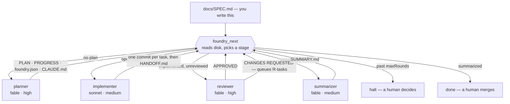
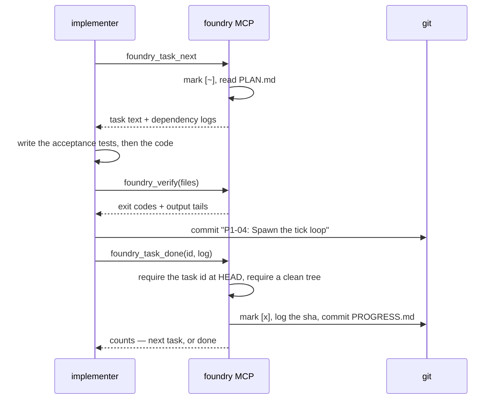

# Foundry

A Claude Code plugin that turns `docs/SPEC.md` into a merge-ready branch with
nobody sitting between the stages. Plan, implement, review, fix, review again,
summarize — a strong model does the judgment work, a cheap one does the
mechanical work, and a zero-dependency MCP server does everything that should
never be left to a language model at all. You write the spec and you merge the
branch. Foundry does the part in between.

## What's in the box

- **Four stage agents**, each pinned to its own model and effort level:
  `planner` (fable, high), `implementer` (sonnet, medium), `reviewer` (fable,
  high), `summarizer` (fable, medium). Switching happens per stage, not per
  session, so the expensive model is only spent on the parts that need it.
- **A flight controller** — `/foundry:go-flight` — that makes no engineering
  decisions. It asks the MCP what runs next, spawns that agent, and repeats
  until the pipeline reports `done` or `halt`.
- **A deterministic MCP server** (`mcp/server.mjs`, no dependencies, Node ≥ 22)
  that owns stage selection, task selection, dependency skipping, checkbox
  edits, log entries, verification runs and every bookkeeping commit. The
  prose in the skills directs judgment; it never describes mechanics.
- **A Stop-hook guard** that refuses to let the implementer stop while tasks
  are open, and gives up after a configurable cap so a wedged run ends instead
  of spinning forever.
- **Blocked-task handling** that keeps an unattended run moving: a task that
  cannot be done is reset, logged and left for the reviewer; its dependents are
  skipped rather than attempted.
- **A complete paper trail on disk** — plan, progress, handoff, review,
  summary — all committed, so a flight can be resumed from any point by
  re-running one command.

## How a flight works



Nothing in that loop is decided by a model reading its own past output. Every
arrow is `foundry_next` re-reading what is actually on disk, which is why a
flight survives compaction, a crashed subagent, or being resumed a day later.

## The task loop

Inside the implement stage, the MCP holds the pen on everything except the code
itself:



The implementer never edits `docs/PROGRESS.md`, never chooses its own next
task, and cannot mark work done that it did not commit.

## Install

The MCP server has no dependencies. Node ≥ 22 and git are all it needs.

```bash
# try it for one session
claude --plugin-dir /path/to/foundry

# or install from the repo, which is its own marketplace
claude plugin marketplace add ericmann/foundry
claude plugin install foundry@ericmann
```

Plugin skills are namespaced, so the entry point is `/foundry:go-flight`; the
bare `/go-flight` form does not resolve for plugin skills.

## Per-project use

```bash
mkdir myproject && cd myproject && git init -b main
mkdir docs
cp /path/to/foundry/templates/SPEC.md docs/SPEC.md   # then write the spec
# drop mockups, fixtures and diagrams next to it in docs/
git add -A && git commit -m "spec"

claude --permission-mode acceptEdits
> /foundry:go-flight
```

`acceptEdits` (or `bypassPermissions` on a throwaway box) matters: plugin
subagents cannot set their own permission mode, and an unattended implementer
that hits a permission prompt will sit there until the guard's cap trips. The
`verify` commands in `docs/foundry.json` run through the MCP rather than the
model's Bash tool, so those never prompt.

Stages also run by hand, with the same model switching:
`/foundry:plan-build`, `/foundry:implement`, `/foundry:review-build`,
`/foundry:summarize`. Each skill's frontmatter carries its model and effort, so
invoking it switches for that turn and switches back after.

Writing the spec is the part that decides whether any of this works —
[docs/writing-specs.md](./docs/writing-specs.md) covers what the planner needs
from it and what it does with each section.

## Files the pipeline owns

| File | Written by | Read by |
|---|---|---|
| `docs/SPEC.md` | you | everyone |
| `docs/PLAN.md` | planner (reviewer appends `## Review fixes (round N)`) | implementer, reviewer |
| `docs/PROGRESS.md` | MCP only | guard hook, everyone |
| `docs/foundry.json` | planner | MCP (`verify`, `extraVerify`, `maxRounds`, `baseBranch`, `branchPrefix`) |
| `CLAUDE.md` | planner | implementer, reviewer |
| `docs/HANDOFF.md` | implementer | reviewer, summarizer |
| `docs/REVIEW.md` | reviewer | summarizer |
| `docs/SUMMARY.md` | summarizer | you |
| `.foundry/state.json` | MCP (committed) | `foundry_next` |
| `.foundry/implement.lock` | MCP (gitignored) | guard hook |

Checkbox states in `PROGRESS.md`: `[ ]` todo · `[~]` in progress · `[x]` done ·
`[!]` blocked · `[-]` skipped because a dependency is blocked.

## MCP tools

| Tool | Does |
|---|---|
| `foundry_status` | Everything on disk: docs present, counts, branch/base/head, lock, round, verdict |
| `foundry_next` | The state machine. Returns `{stage, agent, round, reason, prompt}` |
| `foundry_run_start` | Create or reuse `build/<date>`, arm the lock, stamp PROGRESS, commit. Idempotent |
| `foundry_task_next` | Pick first `[~]` else first `[ ]`, auto-skip dependency-blocked tasks, mark `[~]`, return PLAN text and dependency logs |
| `foundry_task_done` | Requires `<ID>:` at HEAD and a clean tree; mark `[x]`, log with the sha, commit |
| `foundry_task_block` | `git reset --hard && git clean -fd`, mark `[!]`, log `BLOCKED:`, commit |
| `foundry_verify` | Run `verify` plus any `extraVerify` commands matching the touched paths; return exit codes and tails |
| `foundry_run_finish` | Requires zero open tasks and `HANDOFF.md`; commit, push, draft a PR, disarm the lock |
| `foundry_review_submit` | `APPROVED` → commit. `CHANGES REQUESTED` → assign `R<N>-<nn>`, append to PLAN and PROGRESS, unblock, commit `review: round N` |
| `foundry_summary_commit` | Commit `SUMMARY.md`, mark the flight complete |

Full arguments, return shapes and failure modes:
[docs/mcp-tools.md](./docs/mcp-tools.md).

## The guard hook

`scripts/implement-guard.sh` runs on `Stop` and `SubagentStop`. While
`.foundry/implement.lock` exists and `## Tasks` still has `[ ]` or `[~]` lines,
it returns `{"decision":"block"}` naming the next task. It counts re-blocks in
the lock file and gives up at `FOUNDRY_GUARD_CAP` (default 500), so a wedged
run ends rather than spinning.

## Resuming and halting

Everything is on disk and committed, so `/foundry:go-flight` can be re-run from
any point: `foundry_next` reads the state and continues. Two things stop a
flight on purpose — a review round past `maxRounds`, and an explicit `halted`
value in `.foundry/state.json`. Both want a human. Raise `maxRounds` in
`docs/foundry.json`, clear `halted`, and run `/foundry:go-flight` again.
[docs/operations.md](./docs/operations.md) has the rest of the runbook,
including what each failure looks like and how to unstick it.

## Repo layout

```text
.
├── README.md                    you are here
├── .claude-plugin/              plugin.json + marketplace.json
├── .mcp.json                    how Claude Code launches the MCP server
├── mcp/server.mjs               the deterministic half of the pipeline
├── hooks/hooks.json             Stop / SubagentStop wiring
├── scripts/
│   ├── implement-guard.sh       the guard hook
│   ├── lint.sh                  dependency-free syntax + manifest lint
│   └── check-diagrams.mjs       parses every Mermaid block (CI only)
├── agents/                      planner · implementer · reviewer · summarizer
├── skills/                      go-flight · plan-build · implement · review-build · summarize
├── templates/SPEC.md            the spec skeleton the planner reads
├── docs/                        architecture · MCP reference · spec guide · runbook
└── test/                        harness + seven suites, run by test/run.mjs
```

## Documentation map

- [**docs/architecture.md**](./docs/architecture.md) — why the pipeline is
  split this way, what each stage may and may not do, and where state lives
- [**docs/mcp-tools.md**](./docs/mcp-tools.md) — every tool, argument, return
  field and refusal
- [**docs/writing-specs.md**](./docs/writing-specs.md) — how to write a
  `SPEC.md` the planner can turn into a plan worth executing
- [**docs/operations.md**](./docs/operations.md) — running, resuming,
  halting, and what to do when a stage misbehaves
- [**CONTRIBUTING.md**](./CONTRIBUTING.md) — layout, tests, and the rules
  about where behaviour is allowed to live
- [**CHANGELOG.md**](./CHANGELOG.md) — what shipped, when

## Adapting it

- Models and effort live in `agents/*.md`, with matching frontmatter in
  `skills/*/SKILL.md` for manual invocation. Change them there and nowhere
  else.
- Project-specific constraints belong in `SPEC.md` §3. The planner turns them
  into `## Constraints` in `CLAUDE.md`, which is the first thing the reviewer
  checks. Nothing project-specific lives in the plugin.
- `templates/SPEC.md` shows the headings the planner looks for by name.

## Testing

```bash
npm run lint    # node --check, bash -n, JSON parse, executable bits
npm test        # every suite
npm test -- guard protocol     # one or more suites by name
KEEP_REPO=1 npm test -- drive  # keep the temp repos to poke at afterwards
```

Seven suites, about 480 assertions: the plugin manifests and documentation links,
the JSON-RPC transport, the `foundry_next` decision table, the implement-stage
tools, the review and summary tools, the guard hook, and one end-to-end flight
driven over real stdio against a real git repo. CI runs all of it on every
supported Node line — 22, 24 and 26 — again on macOS, and again on a machine
with no GitHub CLI installed.

## Note on the name

I have used this name before. The last Foundry was an orchestrator built on
long-running agents, and it broke the way every one of those attempts broke:
the daemon drifted, forgot what it was doing, and accumulated state nobody
could audit. This one has no daemon and no memory. Each stage is a fresh
subagent that reads the repo, does one job, writes what it did to disk, and
exits. If that sounds like a constraint, it is — it is the only reason the
pipeline can be trusted to run with nobody watching.

## Contributing

Single-author project, but the rules are written down: CI must pass on every
PR, and `pre-commit install` runs the same checks locally that CI runs
remotely. See [CONTRIBUTING.md](./CONTRIBUTING.md).

## License

[MIT](./LICENSE).
