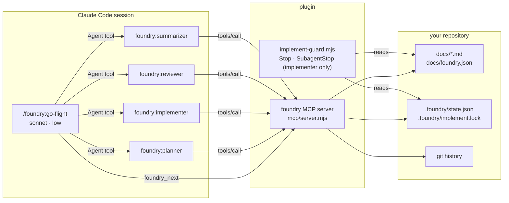
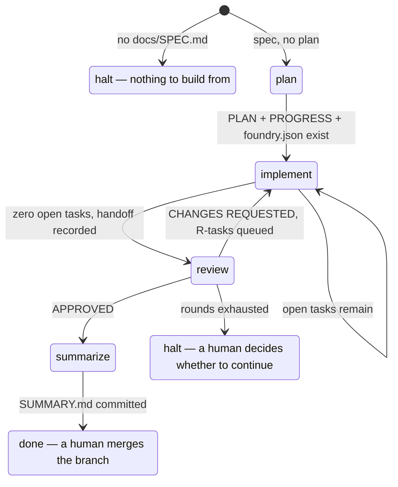
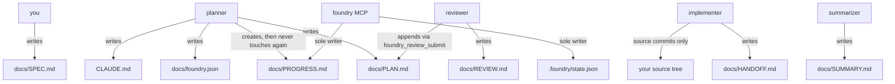
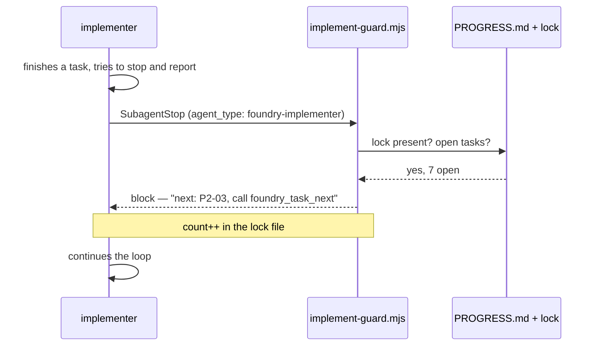

# Architecture

Foundry is four subagents, one flight controller, one MCP server and one Stop
hook. The design rule behind all of it: **a language model decides what the
code should be; nothing else.** Stage selection, task selection, checkbox
edits, log entries, verification and commits are code, not prose, because
those are exactly the things a model gets subtly wrong when its context is
compacted for the fortieth time.

## The pieces

The flight controller is deliberately the weakest model in the system. It has
access to four tools — `Agent`, `foundry_status`, `foundry_next` and
`foundry_agents_sync` — and none of the MCP ones change project state.
`foundry_agents_sync` writes only the generated agent files under
`.claude/agents/` and a `.git/info/exclude` line (see
[routing.md](./routing.md)); it cannot start a run, mark a task, or record a
verdict even if it decides it should.

## The stage machine

`foundry_next` is a pure function of what is on disk. It never reads a
subagent's report, and the flight controller is told not to interpret one.

The decision order, exactly as the server evaluates it:

1. No `docs/SPEC.md` → **halt**.
2. `state.halted` is set → **halt** with that reason.
3. Any of `PLAN.md`, `PROGRESS.md`, `foundry.json` missing → **plan**.
4. Open tasks and `round > maxRounds` → **halt**.
5. Open tasks → **implement**.
6. Lock present (a run died before its handoff) → **implement**.
7. Nothing recorded as implemented → **implement**.
8. Not yet reviewed → **review**.
9. Verdict `CHANGES REQUESTED` but nothing open → **halt** (an impossible
   state; the tool that queues fix tasks failed).
10. `APPROVED` and not summarized → **summarize**.
11. Summarized → **done**.

Decision 2's `state.halted` is set by `foundry_review_submit` past
`maxRounds` (see below) or, directly, by `foundry_run_halt` — the tool an
implementer calls for an operator-level problem it cannot resolve itself
(F-05): a dead signing agent, a full disk, a vanished base branch.

Each stage comes back with a `prompt` the flight controller passes to the
subagent verbatim; the implement, review and summarize prompts each end with
one sentence stating this run's policies (`signing`, `push`, `pr`), so every
stage knows them without re-deriving them. The prompt is generated by the
server, not written by the
controller, so the instruction a stage receives does not drift with the
controller's context.

## Who may write what

`docs/PROGRESS.md` has exactly one writer: the MCP. That is what makes the
guard hook trustworthy — the file it counts open tasks in cannot be edited by
the thing it is guarding.

## Why the models are split this way

| Stage | Model | Effort | Why |
|---|---|---|---|
| go-flight | sonnet | low | Reads a JSON field, calls one tool. Any judgment here is a bug. |
| planner | fable | high | The plan is the whole product. Everything downstream inherits its mistakes, and nothing downstream is empowered to fix a bad decomposition. |
| implementer | sonnet | medium | Bounded, well-specified tasks with acceptance tests named up front. This is the stage that runs for hours, so it is the one worth making cheap. |
| reviewer | fable | high | Reviews work it did not do, against a spec it must read in full, with the authority to reject. Weak review is worse than none. |
| summarizer | fable | medium | Synthesis across plan, handoff and every review round, for a human who was not there. |

These are the plugin defaults, in `agents/*.md`; per-machine and per-project
routing overrides them — see [routing.md](./routing.md). The stage skills
themselves carry no model of their own (`model: inherit`), so invoking one
directly instead of through its agent runs it on your session's current
model.

## The unattended contract

An implement run can last hours and will be compacted repeatedly. Three
mechanisms keep it honest:

- **The lock.** `foundry_run_start` writes `.foundry/implement.lock` as JSON
  (`{ count, armedAt, round }`; a bare-number lock left by a 0.2.x run is
  still read correctly). It is gitignored, so `git clean -fd` during a
  blocked task leaves it alone, and `count` is the re-block counter.
- **The guard.** `implement-guard.mjs` runs on `Stop` and `SubagentStop`,
  but only *considers* a stop that belongs to the implementer: a
  `SubagentStop` whose `agent_type` names it (scoped further at the
  hook-registration level by `hooks/hooks.json`'s matcher, so the harness
  never even runs the guard for another subagent), or a `Stop` whose own
  transcript called `foundry_run_start` (the implement stage run directly in
  a session, not a background flight another session is merely waiting on —
  see [operations.md](./operations.md) and F-07 in the project's feedback
  history). For a stop it does consider, it counts `[ ]` and `[~]` lines
  under `## Tasks`; if the lock exists and the count is non-zero it returns
  `{"decision":"block"}` with the next task's id and instructions to call
  `foundry_task_next`. `foundry_task_done`, `foundry_task_block` and
  `foundry_run_start` all reset the counter to zero, so the cap bounds
  re-blocks since the last time work actually moved, not over the whole
  run — a large plan making normal progress cannot exhaust it. At the
  effective cap (`docs/foundry.json`'s `guardCap`, carried in the lock;
  else `FOUNDRY_GUARD_CAP`; else 60) it stops blocking and emits a
  `systemMessage` naming the stalled task instead, leaving the lock in
  place so the next `foundry_next` sees the unfinished run.
- **The refusals.** `foundry_task_done` requires HEAD's subject to start with
  the task id and the tree to be clean apart from `PROGRESS.md`.
  `foundry_run_finish` requires zero open tasks, a `HANDOFF.md`, and a clean
  tree. Neither can be talked into accepting a claim.

A controller session that merely spawned the implementer and is waiting on
it receives its own, unrelated `Stop` events; since that session's own
transcript never called `foundry_run_start`, the guard allows those without
touching the counter (F-07).

## Blocked tasks and skipped dependents

A task the implementer cannot finish is not a stopped run. `foundry_task_block`
hard-resets the working tree, marks the task `[!]`, logs
`BLOCKED: <what was tried / what fails / what the fix might be>`, and commits.
The next `foundry_task_next` call walks forward, and any task whose
`**Depends on:**` names a blocked or skipped task is marked `[-]` and logged
with its cause — transitively, in one pass, in one commit.

The reviewer decides what happens next: unblock the task with a reason, queue a
fix task that addresses the blocker, or approve around it. An `APPROVED`
verdict with blocked tasks outstanding is possible but the review skill tells
the reviewer not to give one.

## Review rounds

Two numbers, easy to conflate, so the server owns the distinction rather
than any model computing it (F-10, F-11):

- **`round`** — `state.round` — the number of review-fix rounds whose tasks
  have already been queued. `0` during the initial build; a `CHANGES
  REQUESTED` verdict is the only thing that increments it.
- **`reviewRound`** — always `round + 1` — the number the *next* review is
  stamped with, and the prefix of the fix tasks it may queue. `foundry_status`
  and `foundry_next` both expose it, and the review prompt states it in
  words ("This review is round N"), so a reviewer never has to compute it
  from `round` and risk being off by one.

`foundry_review_submit` reads `docs/REVIEW.md`'s `Round:` line and refuses,
for either verdict, if it is missing or not equal to `reviewRound` — a wrong
number never reaches a commit.

For `CHANGES REQUESTED`, this is the only way findings become work:

1. Each finding is validated — `title`, `goal`, `files` and `tests` are
   mandatory, so "this looks wrong" cannot become a task.
2. Ids are assigned `R<reviewRound>-<nn>`, zero-padded, in submission order.
   A `dependsOn` must name an existing task or one of this same
   submission's own ids; anything else is refused.
3. A `## Review fixes (round N)` section is appended to `PLAN.md` in the exact
   task format the implementer already reads.
4. Checkbox lines are appended to `PROGRESS.md`, after the last task and before
   `## Log`.
5. Tasks named in `unblock` are reset to `[ ]` with the reviewer's reason in
   the log.
6. Round, verdict and — if the cap is exceeded — the halt reason are written to
   `.foundry/state.json`.
7. All of it lands in one commit, `review: round N`, then pushed per
   `policies.push` (F-18).

An `APPROVED` verdict commits `REVIEW.md` as `review: round N approved` and
pushes the same way; `round` itself does not change, since nothing new was
queued.

The round-trip matters: what the reviewer submits as structured JSON is
rendered into PLAN.md and parsed straight back out by `foundry_task_next`. A
fix task is a task, and it goes through the same test-first loop as any other.

## State on disk

| Path | Committed | Contents |
|---|---|---|
| `.foundry/state.json` | yes | `round`, `implemented`, `reviewed`, `verdict`, `summarized`, `halted`, `preexistingUntracked`, `policies`, `signing` |
| `.foundry/implement.lock` | no (gitignored) | JSON `{ count, armedAt, round }` — the guard's re-block counter (a legacy bare number still reads back correctly) |
| `docs/PROGRESS.md` | yes | task checkboxes and the per-task log |
| `docs/foundry.json` | yes | `verify`, `extraVerify`, `build`, `baseBranch`, `branchPrefix`, `maxRounds`, `commandTimeoutMs`, `roles`, `permissionMode` |
| `.claude/agents/foundry-*.md` | no (`.git/info/exclude`) | the generated per-role agents; see [routing.md](./routing.md) |
| `~/.config/foundry/config.json` | n/a (outside the project) | the global routing config, its profiles |

A corrupt `state.json` degrades to defaults rather than failing — the tasks on
disk are the real record. A corrupt `foundry.json` is a hard error, because
guessing at someone's verify commands is worse than stopping.
